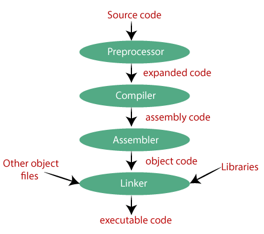
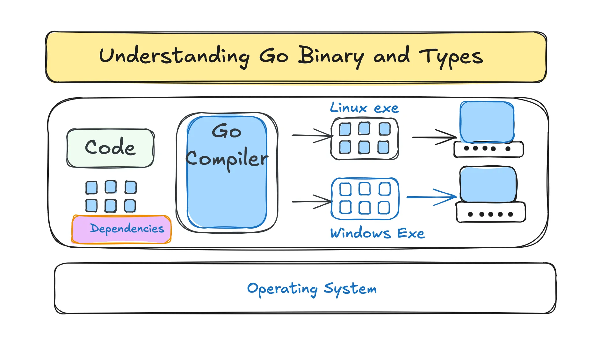
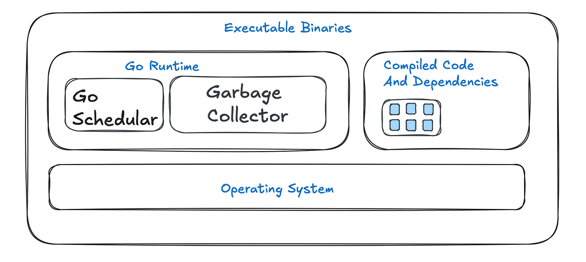

# Golang Features

- Golang supports backward-compatibility and forward-compatibility.
- Go is a static typing language.
- Everything is value in go. we do not have reference.
- Go --compile--> some object files --linker--> single binary.

- Go has garbage collector so you don't manage the memory like C or C++.
- Go binary output has 2 layers: our application and go runtime. go adds some binary to out binary by itself that adds some features like memory management, go routine management and ... to out program; so the go binary outputs are heavy.

