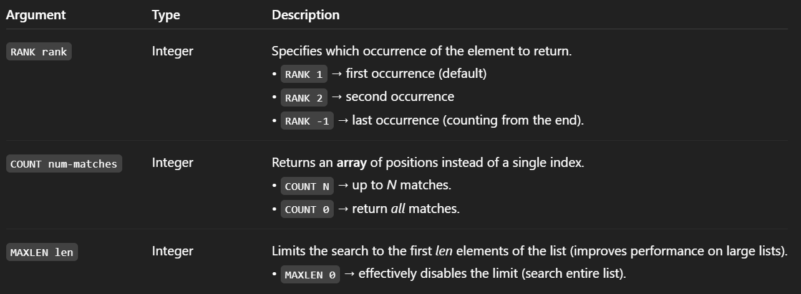

# LPOS
The command returns the index of matching elements inside a Redis list. By default, when no options are given, it will scan the list from head to tail, looking for the first match of "element". If the element is found, its index (the zero-based position in the list) is returned. Otherwise, if no match is found, nil is returned.

## Syntax
```
LPOS key element [RANK rank] [COUNT num-matches] [MAXLEN len]
```

## Time Complexity
O(N) where N is the number of elements in the list, for the average case. When searching for elements near the head or the tail of the list, or when the MAXLEN option is provided, the command may run in constant time.

## Options


## Return Value
Any of the following:

1. **Nil reply**: if there is no matching element.
2. **Integer reply**: an integer representing the matching element.
3. **Array reply**: If the COUNT option is given, an array of integers representing the matching elements (or an empty array if there are no matches).

## Examples
```bash
redis> RPUSH mylist a b c d 1 2 3 4 3 3 3
(integer) 11
redis> LPOS mylist 3
(integer) 6
redis> LPOS mylist 3 COUNT 0 RANK 2
1) (integer) 8
2) (integer) 9
3) (integer) 10
```