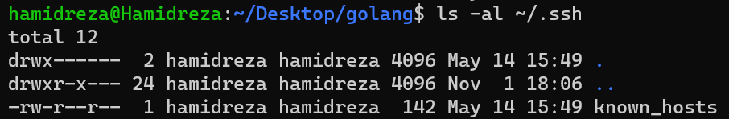
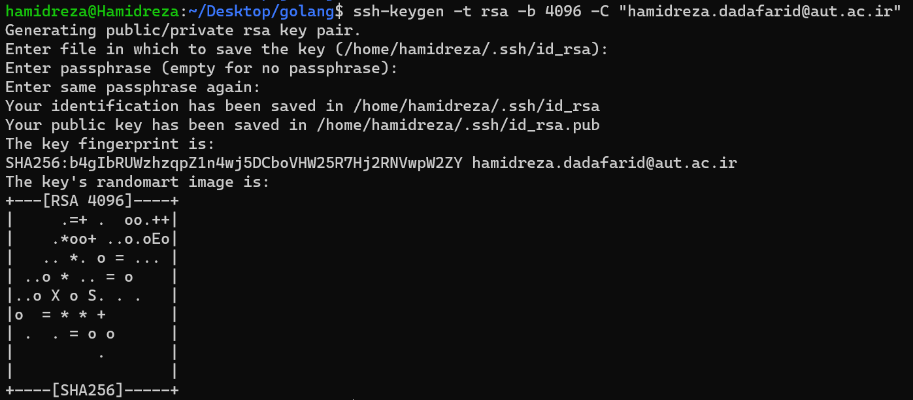
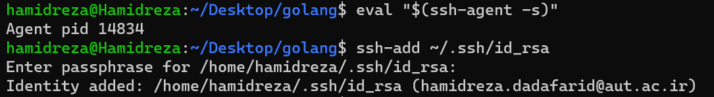
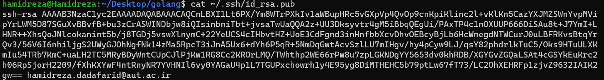
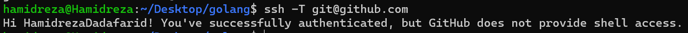

# Setting Up SSH Authentication for GitHub
SSH authentication lets you securely connect to GitHub without having to enter your password or personal access token each time. Here’s a step-by-step guide to setting up SSH keys for your GitHub account.

---

## 🚀 Steps to Set Up SSH Authentication

### Step 1: Check for Existing SSH Keys

First, check if you already have an SSH key pair on your system:

```bash
ls -al ~/.ssh
```



Look for files named `id_rsa` and `id_rsa.pub`. If these exist, you can skip to **Step 3**. Otherwise, continue to **Step 2** to create new keys.

---

### Step 2: Generate a New SSH Key Pair

To create a new SSH key pair:

1. Run this command, replacing `<your-email@example.com>` with the email address associated with your GitHub account:

   ```bash
   ssh-keygen -t rsa -b 4096 -C "<your-email@example.com>"
   ```

2. When prompted to "Enter a file in which to save the key," press **Enter** to use the default location (`~/.ssh/id_rsa`).
3. Optionally, set a passphrase for added security.



---

### Step 3: Start the SSH Agent and Add Your Key

1. Start the SSH agent in the background:

   ```bash
   eval "$(ssh-agent -s)"
   ```

2. Add your SSH private key to the SSH agent:

   ```bash
   ssh-add ~/.ssh/id_rsa
   ```



---

### Step 4: Add Your SSH Public Key to GitHub

1. Copy your public SSH key to your clipboard:

   ```bash
   cat ~/.ssh/id_rsa.pub
   ```



   Copy the displayed key (it begins with `ssh-rsa`).

2. Go to your GitHub account and add the SSH key:
    - **Settings** > **SSH and GPG keys**
    - Click **New SSH key**.
    - Add a descriptive title (e.g., "My Laptop") and paste your SSH key into the "Key" field.
    - Click **Add SSH key**.

---

### Step 5: Test Your SSH Connection to GitHub

Verify that your setup works by running:

```bash
ssh -T git@github.com
```



You should see a success message, like:

```
Hi <username>! You've successfully authenticated, but GitHub does not provide shell access.
```

---

### Step 6: Update Git Remote URL to Use SSH

Update your repository to use SSH (replace the URL with your repository’s SSH URL):

```bash
git remote set-url origin git@github.com:HamidrezaDadafarid/Golang.git
```

Now you can push and pull from GitHub without entering credentials each time:

```bash
git push -u origin master
```

---

## 🎉 You're All Set!

You’ve successfully configured SSH authentication for GitHub. Now you can work securely and conveniently without needing to enter credentials every time. Happy coding! 🧑‍💻

